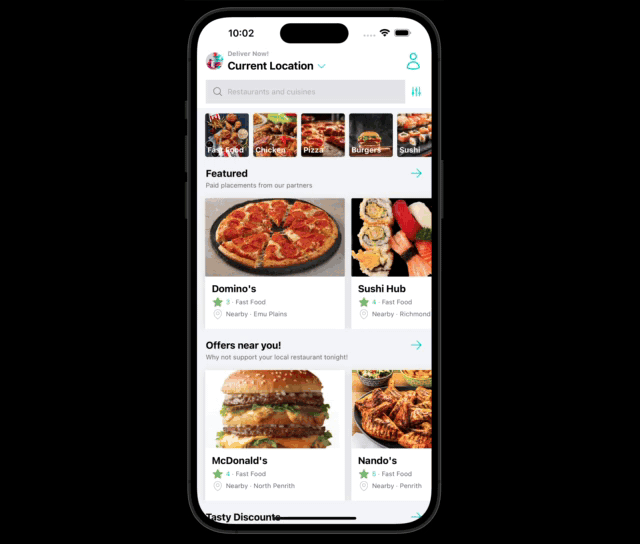

# Food Delivery App

This application mocks the functionality and appearance of a Food Delivery App. It works across iOS, Android, and web. This project is strictly for educational purposes only. All images and assets are property of their respective businesses.

<br />

<div style='text-align: center;'>
  
</div>

## Technology Requirements / Purpose

Application was built using the following technologies:

-    React Native
-    Tailwind CSS
-    Sanity CMS (using GROQ to query https://www.sanity.io/docs/groq)
-    Redux
-    Expo Go
-    React Native Navigation
-    React Native Maps (https://github.com/react-native-maps/react-native-maps)

This project was built to develop a better understanding of utilising React Native to develop a cross-platform mobile application. It uses Sanity as a Content Management System to simplify record creation and maintenance. It also uses Expo Go to create a sandboxed instance of the application on respective simulator devices.

Finally, restuarant location is displayed and pinned on the Delivery Screen.

## Build Steps

```bash
$ npm install
```

## Running the app

Provided Expo was successfully installed, simply run the following command.

```bash
# development
$ npx expo start
```

If using in conjunction with Sanity, you will need to visit the following site:

https://www.sanity.io/

Once logged in, you will need to click the "Create New Project" button. After a project id is acquired, you can update the projectId in sanity.js in the root folder.

You can then run the local instance of Sanity cli by going into the sanity folder and running the following command:

```bash
# development
$ npm run dev
```

You can now access from http://localhost:3333/

Any changes made to Sanity schemas will need to be deployed to production by going to the sanity folder and using the following command:

```bash
# development
$ sanity deploy
```

## Design Goals

-    To develop an application with similar look and feel of a food delivery application.
-    Designed in React Native to take advantage of cross-platform compatibility.

## Known issues

-    Although functioning as expected, receiving a warning on Restaurant screen regarding memoization of products. System wants code to be re-written to cache values that haven't changed as opposed to mapping through enitire product listing.

## Future Goals

-    Implement actual payment system. At the moment, this application simply demonstrates look and feel of the functionality without actually handling payments.

## Road Blocks

-    Recent upgrade of Expo Go (08/05/24) was causing application to crash when managing navigation (useNavigation()). This took several hours to rectify as it was initially working prior to updating Expo. I needed to drop down to Expo (v50) to rectify. Unfortunately, this does not allow the generated QR code for the application to install directly onto iPhone for testing, only simulator.
